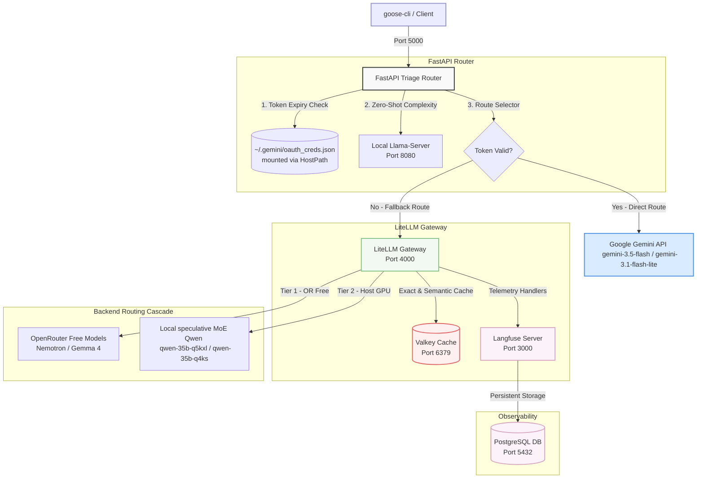
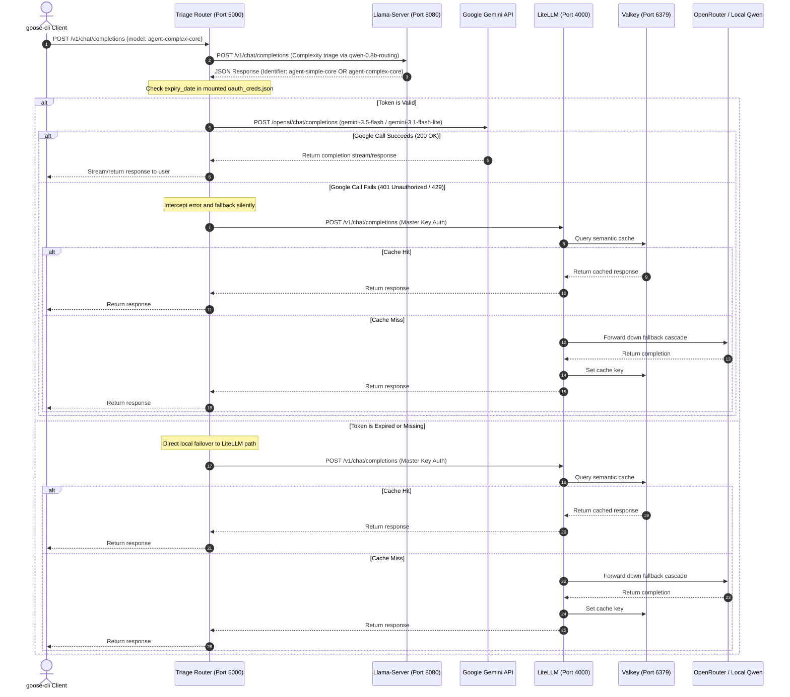

# Unified LLM Triage & Observability Gateway Stack

This repository contains the production-grade, rootless local deployment configurations, automated scripts, and comprehensive telemetry systems for the **LLM Triage & Fallback Gateway** on Fedora 44.

The gateway exposes a unified OpenAI-compatible endpoint that dynamically assesses prompt complexity, routes requests to optimal models, manages automatic cascading fallbacks, caches responses semantically via Valkey, and tracks full agentic nested executions in a self-hosted Langfuse dashboard.

---

## 1. System Architecture

The gateway runs as a rootless Podman pod (`agent-router-pod`) utilizing **Host Networking** (`hostNetwork: true`). This design eliminates complex container network bridges, allowing microservices to communicate with extremely low latency and bind directly to localhost ports, matching the behavior of your native services (such as your local GPU-accelerated `llama-server`).

### High-Level Topology



---

## 2. Request Lifecycle & Telemetry Flow

The following sequence diagram outlines the end-to-end synchronous flow of an LLM completion request sent by an agent through the gateway stack:



---

## 3. Directory Layout

All configurations, automation scripts, and databases are self-contained within this repository directory:

```
/home/gpav/Vrac/LAB/AI/LLM-Routing/
├── .env                 # Environment file for OpenRouter API Key (ignored by git)
├── .gitignore           # Git ignore policy protecting secrets & database files
├── README.md            # In-depth system and operational guide
├── pod.yaml             # Podman Kubernetes template defining the container stack
├── start-stack.sh       # Unified startup and credential extraction script (executible)
├── litellm/
│   └── config.yaml      # LiteLLM fallback chains, caching definitions & telemetry keys
├── router/
│   ├── Containerfile    # Container construction rules for the FastAPI server
│   ├── config.yaml      # Classifier prompt definitions & host connection targets
│   └── main.py          # FastAPI Reverse-Proxy + Glassmorphic Control Dashboard
├── valkey-data/         # [Git Ignored] Persistent memory volumes for Valkey Cache
├── postgres-data/       # [Git Ignored] Persistent tables for Langfuse database
└── langfuse-data/       # [Git Ignored] Persistent trace assets
```

---

## 4. Multi-Tier Gateway Configurations

### A. Custom Triage Router (`router/main.py`)
Exposes the entry endpoint (`http://localhost:5000/v1`) and evaluates prompt complexity via the fast local `qwen-0.8b-routing` (Vulkan offloaded Ryzen PRO APU).
- **Thinking Support**: Parses both `content` and `reasoning_content` API response fields to gracefully support local models configured with speculative decoding/thinking blocks.
- **Reverse Proxy**: Preserves streaming payloads, header validation, and response signatures, passing incoming requests directly to the secondary LiteLLM proxy port.

### B. LiteLLM Proxy Gateway (`litellm/config.yaml`)
Orchestrates routing fallback chains, Redis caching, and telemetry callbacks:
- **`drop_params: true`**: Automatically strips unsupported arguments when transitioning to models that don't support them.
- **Request Timeouts (`300s`)**: Provides ample padding to prevent connection aborts during dynamic RAM swapping operations on the local GPU `llama-server`.
- **Primary Cascading Fallback Chains**:
  - **`agent-complex-core` (Complex tier)**: `OpenRouter Nemotron 120b (Free)` ➔ `Local Qwen-35b-q5kxl (Speculative MoE)`.
  - **`agent-simple-core` (Simple tier)**: `OpenRouter Gemma 4 26b (Free)` ➔ `Local Qwen-35b-q4ks (High-speed Fast)`.
*Note: In the hybrid routing setup, the Triage Router dynamically intercepts complex and simple models to execute direct Google AI subscription OAuth routes (`gemini-3.5-flash` / `gemini-3.1-flash-lite`) if a valid token is found, automatically falling back to these LiteLLM chains on expiration.*

### C. Valkey Caching (`redis_settings` in LiteLLM)
Connects directly to the high-performance local `valkey-cache` on port `6379`. LiteLLM transparently writes prompt-response mappings to the cache, resulting in **zero-latency completions** for exact repeat prompt structures.

---

## 5. Setup & Deployment Instructions

### Prerequisites
1. **Llama-Server Active**: Verify that your local user-level GPU-accelerated server is active:
   ```bash
   systemctl --user status llama-server.service
   ```
2. **Google OAuth Token Resolvable**: Make sure you have launched the Antigravity IDE or CLI and are logged in, ensuring active OAuth credentials reside at:
   ```bash
   ls -la ~/.gemini/oauth_creds.json
   ```

### 1. Launching the Stack
Run the startup script from the root of the repository:
```bash
./start-stack.sh
```
*Note: If running for the first time, the script will prompt you for your `OpenRouter API Key`, securely saving it inside `.env` with restrictive permissions (`chmod 600`).*

### 2. Verify Container Status
Check that all 5 containers inside `agent-router-pod` are up and running:
```bash
podman pod ps
podman ps
```
Your output should display:
* `valkey-cache`
* `litellm-gateway`
* `llm-triage-router`
* `postgres-db`
* `langfuse-server`

---

## 6. Verification & Testing

To test the zero-shot router classification and complete gateway execution, run this command from your host terminal:

```bash
curl -s http://127.0.0.1:5000/v1/chat/completions \
  -H "Content-Type: application/json" \
  -H "Authorization: Bearer gateway-pass" \
  -d '{
    "model": "agent-triage",
    "messages": [
      {"role": "user", "content": "Write a quick hello world in Python."}
    ]
  }'
```

Check the triage classification and model cascades by viewing the router container's standard output logs:
```bash
podman logs agent-router-pod-llm-triage-router
```

---

## 7. Integrated Glassmorphic Status Dashboard

Navigate your web browser to:
👉 **`http://localhost:5000/dashboard`**

The triage router hosts a beautiful, single-pane-of-glass **Glassmorphic Status Control Panel** styled with modern vanilla CSS featuring:
* **System Status Healthchecks**: Live connection status checks via TCP sockets (Valkey, Postgres) and HTTP pings (LiteLLM, Llama-server).
* **Real-time Routing Metrics**: Active classification splits (simple vs complex), request logs, and processing latencies.
* **Direct Application Portals**: One-click navigation links to target web utilities (LiteLLM administration console, Langfuse telemetry console, Llama-Server playground).

---

## 8. Deep Observability & Tracing via Langfuse

Open the tracing console in your browser:
👉 **`http://localhost:3000`**

Self-hosted Langfuse acts as your agentic telemetry server. The LiteLLM Gateway is instrumented to automatically pipe detailed trace structures to Langfuse with no changes to client code:
* **Traced Credentials**: Automatic telemetry bootstrapping is pre-configured in `pod.yaml` with pre-defined keys:
  * Public Key: `pk-lf-gateway-token`
  * Secret Key: `sk-lf-gateway-token`
  * Host Address: `http://127.0.0.1:3000`
* **Features**: View hierarchical execution graphs, latency profiles, exact inputs/outputs, cost estimations, and performance benchmarks for simple vs complex prompt splits over time.

### Web Console & Dashboard Directory

For convenient access, the unified stack binds all dashboard controls, status checkers, and tracing endpoints to your host's local loopback interface:

| Web Portal / Service | URL Address | Bound Port | Core Operational Purpose |
| :--- | :--- | :---: | :--- |
| **System Control Dashboard** | [http://localhost:5000/dashboard](http://localhost:5000/dashboard) | `5000` | Real-time health-checks, triage stats, cache hits, and navigation shortcuts. |
| **Langfuse Monitoring UI** | [http://localhost:3000](http://localhost:3000) | `3000` | Nested spans, detailed trace logs, latency tracking, and cost analysis. |
| **LiteLLM Admin Console** | [http://localhost:4000/ui](http://localhost:4000/ui) | `4000` | Gateway fallback configurations, models inventory, and active proxy stats. |
| **Llama-Server Playground** | [http://localhost:8080](http://localhost:8080) | `8080` | Local llama.cpp prompt sandbox, dynamic model stats, and API endpoint details. |

---

## 9. Performance & Triage Optimization Metrics

Through our local benchmarks, the following performance characteristics have been achieved:

| Triage Evaluation Layer | Latency Footprint | Hardware Offload | Efficiency Ratio |
| :--- | :---: | :---: | :---: |
| **Cold-Run Triage** (First query) | ~15 - 24s | Dynamic HF Download | Includes GGUF fetch & initialization |
| **Warm-Run Triage** (Local inference) | **~449 ms** | 100% Vulkan GPU (Ryzen APU) | **12x speedup** compared to 35B model |
| **Triage Cache Hit** (Repeat query) | **0.0 ms** | RAM In-Memory TTL | Infinite speedup, zero backend requests |
| **Valkey Gateway Cache Hit** | **< 10 ms** | Redis RAM Cache | Zero provider cost, immediate response |

