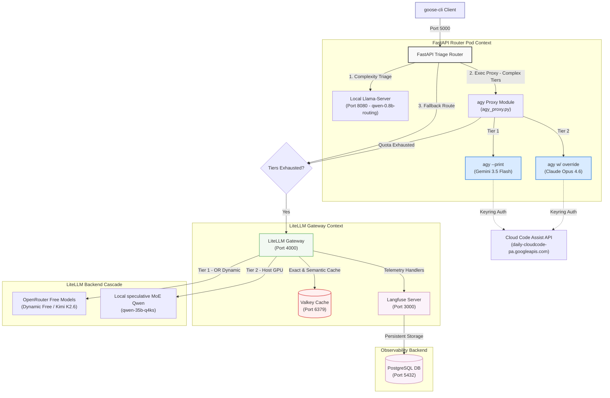
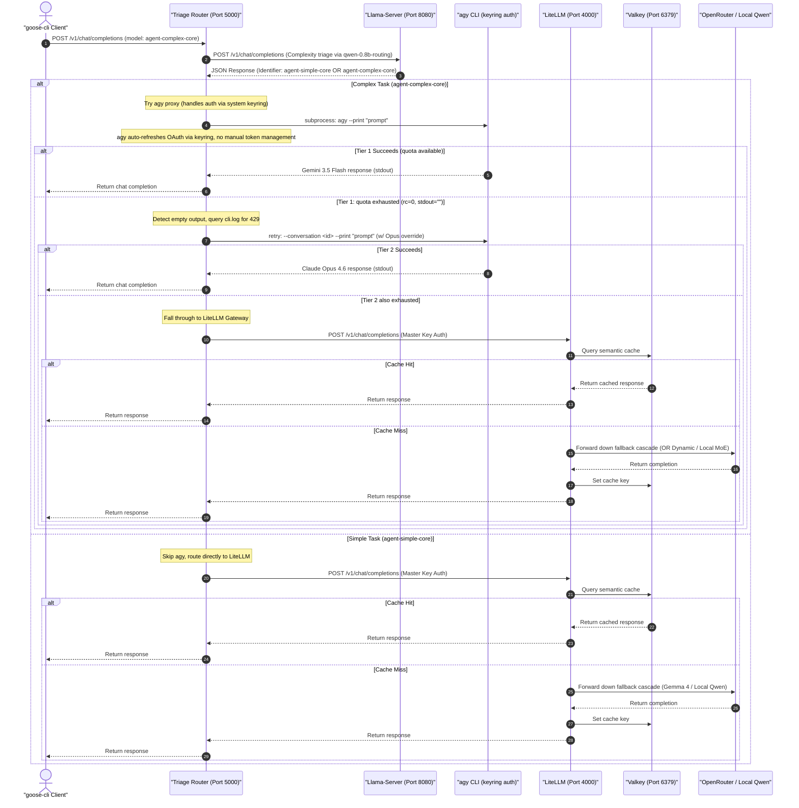

# Unified LLM Triage & Observability Gateway Stack

This repository contains the production-grade, rootless local deployment configurations, automated scripts, and comprehensive telemetry systems for the **LLM Triage & Fallback Gateway** on Fedora 44.

The gateway exposes a unified OpenAI-compatible endpoint that dynamically assesses prompt complexity, routes requests to optimal models, manages automatic cascading fallbacks, caches responses semantically via Valkey, and tracks full agentic nested executions in a self-hosted Langfuse dashboard.

---

## 1. System Architecture

The gateway runs as a rootless Podman pod (`agent-router-pod`) utilizing **Host Networking** (`hostNetwork: true`). This design eliminates complex container network bridges, allowing microservices to communicate with extremely low latency and bind directly to localhost ports, matching the behavior of your native services (such as your local GPU-accelerated `llama-server`).

### High-Level Topology



---

## 2. Request Lifecycle & Telemetry Flow

The following sequence diagram outlines the end-to-end synchronous flow of an LLM completion request sent by an agent through the gateway stack:



---

## 3. Directory Layout

All configurations, automation scripts, and databases are self-contained within this repository directory:

```
/home/gpav/Vrac/LAB/AI/LLM-Routing/
├── .env                 # Environment file for OpenRouter API Key (ignored by git)
├── .gitignore           # Git ignore policy protecting secrets & database files
├── README.md            # In-depth system and operational guide
├── pod.yaml             # Podman Kubernetes template defining the container stack
├── start-stack.sh       # Unified startup and credential extraction script (executible)
├── litellm/
│   └── config.yaml      # LiteLLM fallback chains, caching definitions & telemetry keys
├── router/
│   ├── Containerfile    # Container construction rules for the FastAPI server
│   ├── config.yaml      # Classifier prompt definitions & host connection targets
│   ├── main.py          # FastAPI Reverse-Proxy + Glassmorphic Control Dashboard
│   └── agy_proxy.py     # 3-tier agy fallback with session continuation
├── test_agy_tiers.py    # agy proxy model tier test suite
├── valkey-data/         # [Git Ignored] Persistent memory volumes for Valkey Cache
├── postgres-data/       # [Git Ignored] Persistent tables for Langfuse database
└── langfuse-data/       # [Git Ignored] Persistent trace assets
```

---

## 4. Multi-Tier Gateway Configurations

### A. Custom Triage Router (`router/main.py`)
Exposes the entry endpoint (`http://localhost:5000/v1`) and evaluates prompt complexity via the fast local `qwen-0.8b-routing` (Vulkan offloaded Ryzen PRO APU).
- **Thinking Support**: Parses both `content` and `reasoning_content` API response fields to gracefully support local models configured with speculative decoding/thinking blocks.
- **Reverse Proxy**: Preserves streaming payloads, header validation, and response signatures, passing incoming requests directly to the secondary LiteLLM proxy port.

### B. LiteLLM Proxy Gateway (`litellm/config.yaml`)
Orchestrates routing fallback chains, Redis caching, and telemetry callbacks:
- **`drop_params: true`**: Automatically strips unsupported arguments when transitioning to models that don't support them.
- **Request Timeouts (`300s`)**: Provides ample padding to prevent connection aborts during dynamic RAM swapping operations on the local GPU `llama-server`.
- **Primary Cascading Fallback Chains**:
  - **`agent-complex-core` (Complex tier)**: `Dynamic Top Free Model (Agentic Index)` ➔ `MoonshotAI Kimi K2.6 (Free)` ➔ `Local Qwen-35b-q4ks (Speculative MoE)`.
  - **`agent-simple-core` (Simple tier)**: `OpenRouter Gemma 4 31B (Free)` ➔ `Local Qwen-35b-q4ks (High-speed Fast)`.
*Note: In the hybrid routing setup, the Triage Router dynamically intercepts complex and simple models to execute direct Google AI subscription OAuth routes (`gemini-3.5-flash` / `gemini-3.1-flash-lite`) if a valid token is found, automatically falling back to these LiteLLM chains on expiration.*

### C. Valkey Caching (`redis_settings` in LiteLLM)
Connects directly to the high-performance local `valkey-cache` on port `6379`. LiteLLM transparently writes prompt-response mappings to the cache, resulting in **zero-latency completions** for exact repeat prompt structures.

---

## 5. Setup & Deployment Instructions

### Prerequisites
1. **Llama-Server Active**: Verify that your local user-level GPU-accelerated server is active:
   ```bash
   systemctl --user status llama-server.service
   ```
2. **Antigravity CLI (agy) installed and authenticated**: The router delegates complex tasks to the
   antigravity CLI (`agy`), which handles OAuth via the **system keyring** (not the file on disk).
   Make sure you've launched antigravity and logged in at least once:
   ```bash
   agy --print "Hello"   # Should return a response
   ```
   The binary at `~/.local/bin/agy` is mounted into the router container via hostPath.
   
   > **Note**: `agy` authenticates through the system keyring (GNOME Keyring / KDE Wallet), not
   > from `~/.gemini/oauth_creds.json`. That file is a stale cache and may show an expired token
   > even when `agy` works perfectly. To verify active auth status, check the cli.log:
   > ```bash
   > grep "authenticated successfully" ~/.gemini/antigravity-cli/cli.log
   > ```

### 1. Launching the Stack
Run the startup script from the root of the repository:
```bash
./start-stack.sh
```
*Note: If running for the first time, the script will prompt you for your `OpenRouter API Key`, securely saving it inside `.env` with restrictive permissions (`chmod 600`).*

### 2. Verify Container Status
Check that all 5 containers inside `agent-router-pod` are up and running:
```bash
podman pod ps
podman ps
```
Your output should display:
* `valkey-cache`
* `litellm-gateway`
* `llm-triage-router`
* `postgres-db`
* `langfuse-server`

---

## 6. Verification & Testing

To test the zero-shot router classification and complete gateway execution, run this command from your host terminal:

```bash
curl -s http://127.0.0.1:5000/v1/chat/completions \
  -H "Content-Type: application/json" \
  -H "Authorization: Bearer gateway-pass" \
  -d '{
    "model": "agent-triage",
    "messages": [
      {"role": "user", "content": "Write a quick hello world in Python."}
    ]
  }'
```

Check the triage classification and model cascades by viewing the router container's standard output logs:
```bash
podman logs agent-router-pod-llm-triage-router
```

---

## 7. Integrated Glassmorphic Status Dashboard

Navigate your web browser to:
👉 **`http://localhost:5000/dashboard`**

The triage router hosts a beautiful, single-pane-of-glass **Glassmorphic Status Control Panel** styled with modern vanilla CSS featuring:
* **System Status Healthchecks**: Live connection status checks via TCP sockets (Valkey, Postgres) and HTTP pings (LiteLLM, Llama-server).
* **Real-time Routing Metrics**: Active classification splits (simple vs complex), request logs, and processing latencies.
* **Direct Application Portals**: One-click navigation links to target web utilities (LiteLLM administration console, Langfuse telemetry console, Llama-Server playground).

---

## 8. Deep Observability & Tracing via Langfuse

Open the tracing console in your browser:
👉 **`http://localhost:3000`**

Self-hosted Langfuse acts as your agentic telemetry server. The LiteLLM Gateway is instrumented to automatically pipe detailed trace structures to Langfuse with no changes to client code:
* **Traced Credentials**: Automatic telemetry bootstrapping is pre-configured in `pod.yaml` with pre-defined keys:
  * Public Key: `pk-lf-gateway-token`
  * Secret Key: `sk-lf-gateway-token`
  * Host Address: `http://127.0.0.1:3000`
* **Features**: View hierarchical execution graphs, latency profiles, exact inputs/outputs, cost estimations, and performance benchmarks for simple vs complex prompt splits over time.

### Web Console & Dashboard Directory

For convenient access, the unified stack binds all dashboard controls, status checkers, and tracing endpoints to your host's local loopback interface:

| Web Portal / Service | URL Address | Bound Port | Core Operational Purpose |
| :--- | :--- | :---: | :--- |
| **System Control Dashboard** | [http://localhost:5000/dashboard](http://localhost:5000/dashboard) | `5000` | Real-time health-checks, triage stats, cache hits, and navigation shortcuts. |
| **Langfuse Monitoring UI** | [http://localhost:3000](http://localhost:3000) | `3000` | Nested spans, detailed trace logs, latency tracking, and cost analysis. |
| **LiteLLM Admin Console** | [http://localhost:4000/ui](http://localhost:4000/ui) | `4000` | Gateway fallback configurations, models inventory, and active proxy stats. |
| **Llama-Server Playground** | [http://localhost:8080](http://localhost:8080) | `8080` | Local llama.cpp prompt sandbox, dynamic model stats, and API endpoint details. |

---

## 9a. agy Proxy Integration (Session-Aware 3-Tier Fallback)

The router includes an **agy proxy** layer that delegates complex tasks to the antigravity CLI
(`agy --print`) before falling back to LiteLLM. This provides access to Gemini 3.5 Flash and
Claude models using your Google AI Pro subscription via the Cloud Code Assist API.

### Authentication: System Keyring (not oauth_creds.json)

`agy` authenticates via the **OS system keyring** (GNOME Keyring / KDE Wallet), not from the
`~/.gemini/oauth_creds.json` file on disk. The file is a stale cache and may contain an expired
token even when `agy` is fully authenticated.

Authentication flow (from `cli.log`):
1. `Print mode: not authenticated, trying silent auth`
2. `ChainedAuth: authenticated via keyring (effective: keyring)`
3. `OAuth: authenticated successfully as user@gmail.com`

The router container mounts `~/.gemini` to `/root/.gemini` and the `agy` binary from
`~/.local/bin/agy` to `/usr/local/bin/agy` via hostPath.

### Quota Architecture: Single Shared Daily Bucket

All models accessed through `agy --print` share a **single daily quota** on the Cloud Code Assist
API endpoint (`daily-cloudcode-pa.googleapis.com/v1internal:loadCodeAssist`). When this quota is
exhausted, all model tiers fail until the daily reset.

```
Cloud Code Assist API ← Shared daily quota ← agy --print (any model)
```

The model override env var (`CASCADE_DEFAULT_MODEL_OVERRIDE`) allows switching between Gemini and
Claude backends, but they all draw from the same Cloud Code Assist quota bucket.

### Session Continuation via `--conversation`

The proxy maintains conversation continuity across tier switches and subsequent requests:

1. **First call**: `agy --print "prompt"` → creates conversation, stores ID in cache
2. **Tier switch**: `agy --conversation <id> --print "prompt"` (with model override)
   → continues same conversation with different model
3. **Subsequent calls**: `agy --conversation <id> --print "next prompt"` → preserves context

A session ID is derived from a hash of the message history fingerprint, ensuring requests from
the same goose conversation reuse the same agy conversation.

### Architecture: 2-Tier Fallback Chain

```
Tier 1: agy --print (Default)                → Gemini 3.5 Flash (Cloud Code Assist quota)
        ↓ (quota exhausted / fail)
Tier 2: CASCADE_DEFAULT_MODEL_OVERRIDE=      
        claude-opus-4-6@default               → Claude Opus 4.6 (Premium Anthropic Tier)
        ↓ (all agy tiers exhausted)
Tier 3: LiteLLM Gateway Fallback Chain        → OpenRouter Dynamic Free / Kimi K2.6 → Local speculative MoE Qwen
```

### Quota Detection

`agy` returns `exit code 0` with **empty stdout and empty stderr** when the daily quota is
exhausted. The error is written to the `cli.log` file, not to stderr. Proxy detection:
1. Checks `returncode == 0` and `stdout == ""` and `stderr == ""`
2. Optionally verifies `cli.log` for `RESOURCE_EXHAUSTED`/`code 429` markers
3. Falls through to LiteLLM tier

### Deployment

Additional mounts required in `pod.yaml`:
```yaml
- name: agy-bin              # hostPath: ~/.local/bin
  mountPath: /usr/local/bin/agy
  subPath: agy
- name: gemini-secrets       # hostPath: ~/.gemini (same as OAuth mount)
  mountPath: /root/.gemini   # agy expects config at ~/.gemini
```

### Model Identifiers (found in agy binary)

| Model | Env Var Value | Backend |
|-------|---------------|---------|
| Gemini 3.5 Flash | `""` (auto-select) | Cloud Code Assist (default) |
| Claude Opus 4.6 | `claude-opus-4-6@default` | Anthropic premium tier |
| Claude Sonnet 4.5 | `claude-sonnet-4-5@20250929` | Anthropic via Vertex AI |
| Claude Haiku 4.5 | `claude-haiku-4-5@20251001` | Anthropic lightweight |

### Verification

```bash
# Test Gemini tier
agy --print "Hello"

# Test Claude model override
CASCADE_DEFAULT_MODEL_OVERRIDE=claude-opus-4-6@default agy --print "Hello"

# Test session continuation
agy --print "First message"                    # creates conversation
# agy stores conversation ID in cache/last_conversations.json
agy --conversation <id> --print "Follow-up"    # continues same session

# Run the full tier test suite
python3 test_agy_tiers.py
```

### 9b. Streaming & Concurrency Optimizations

To support production agentic environments (such as `goose-cli` or similar tools) that require low-latency streaming and high concurrent throughput, the following components were introduced:

#### 1. Real-Time Streaming Wrapper for `agy` Response
Although the host-side `agy` CLI executes synchronously and yields its result on completion, the Triage Router acts as a compatibility adapter:
* When `stream: true` is requested by the client, the router detects this and consumes the `agy` output on completion.
* The router runs an asynchronous generator that chunks the static text and yields compliant OpenAI Server-Sent Events (SSE) packets (`data: {"choices": [{"delta": {"content": ...}}]}\n\n`) at low latency intervals, closing with `data: [DONE]`.
* This completely resolves parsing issues in streaming-only event parsers.

#### 2. Sequential Classification Lock (`classification_lock`)
Because the local routing model (`qwen-0.8b-routing`) is optimized for low memory footprint and operates on a single execution slot, concurrent requests could trigger slot conflicts (`400 Bad Request`) in `llama-server`.
* We introduced a global asynchronous lock (`asyncio.Lock`) inside `router/main.py`.
* Classification queries are serialized to execute one-by-one.
* **Double-Cache Check**: To maximize throughput, the cache is checked twice—once immediately upon receiving the query (outside the lock), and a second time after acquiring the lock (in case a queued request completed and populated the cache while we waited). This reduces actual LLM inference calls to a minimum.

#### 3. Custom Memory Endpoint Proxy & MCP Server
To allow Goose (and other agents) to store, list, and delete persistent preference/factual memories, we implemented a custom memory stack:
* **Triage Router Memory Proxy**: Exposes a catch-all route `@app.api_route("/v1/memory{path:path}", methods=["GET", "POST", "DELETE", "PUT"])` in `router/main.py` that intercepts memory calls and proxies them to the LiteLLM gateway (port 4000) using the securely-loaded `LITELLM_MASTER_KEY` authorization.
* **Memory MCP Bridge Server**: Created a custom stdio MCP server in [memory_mcp.py](file:///home/gpav/Vrac/LAB/AI/LLM-Routing/router/memory_mcp.py) that exposes the `rememberMemory`, `retrieveMemories`, and `removeSpecificMemory` tools. The script proxies these commands directly to `http://localhost:5000/v1/memory`.
* **Goose Integration**: The built-in memory extension is disabled in `~/.config/goose/config.yaml` and replaced with the `litellm-memory` custom command-line extension running our bridge server.

## 9c. Performance & Triage Optimization Metrics

Through our local benchmarks, the following performance characteristics have been achieved:

| Triage Evaluation Layer | Latency Footprint | Hardware Offload | Efficiency Ratio |
| :--- | :---: | :---: | :---: |
| **Cold-Run Triage** (First query) | ~15 - 24s | Dynamic HF Download | Includes GGUF fetch & initialization |
| **Warm-Run Triage** (Local inference) | **~449 ms** | 100% Vulkan GPU (Ryzen APU) | **12x speedup** compared to 35B model |
| **Triage Cache Hit** (Repeat query) | **0.0 ms** | RAM In-Memory TTL | Infinite speedup, zero backend requests |
| **Valkey Gateway Cache Hit** | **< 10 ms** | Redis RAM Cache | Zero provider cost, immediate response |

