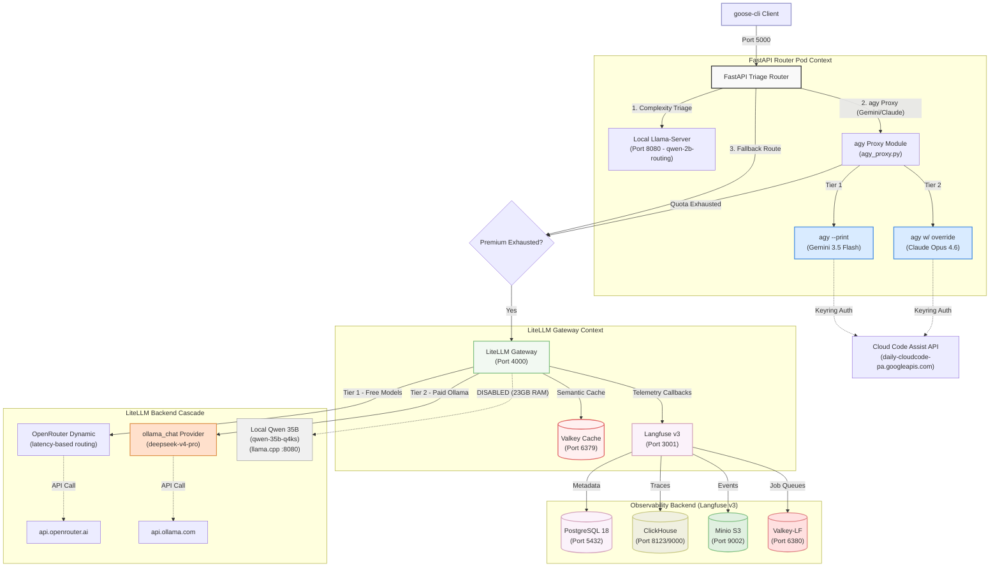
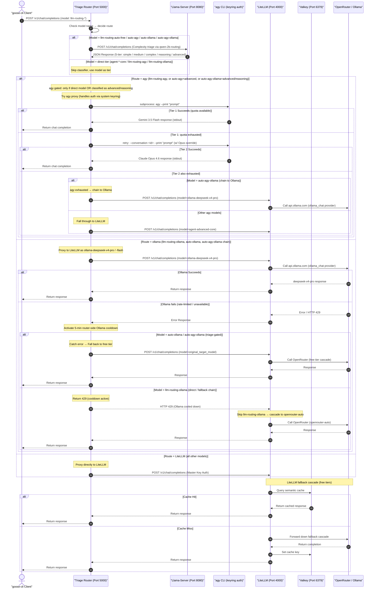

# Unified LLM Triage & Observability Gateway Stack

This repository contains the production-grade, rootless local deployment configurations, automated scripts, and comprehensive telemetry systems for the **LLM Triage & Fallback Gateway** on Fedora 44.

The gateway exposes a unified OpenAI-compatible endpoint that dynamically assesses prompt complexity, routes requests to optimal models, manages automatic cascading fallbacks, caches responses semantically via Valkey (using a local zero-cost embedding model — `nomic-embed-text-v1.5-Q4_K_M` on llama-server — instead of paid OpenRouter embeddings), and tracks full agentic nested executions in a self-hosted Langfuse dashboard.

---

## 1. System Architecture

The gateway runs as a rootless Podman pod (`agent-router-pod`) utilizing **Host Networking** (`hostNetwork: true`). This design eliminates complex container network bridges, allowing microservices to communicate with extremely low latency and bind directly to localhost ports, matching the behavior of your native services (such as your local GPU-accelerated `llama-server`).

### High-Level Topology



> **Version Pin**: LiteLLM Gateway runs `ghcr.io/berriai/litellm:v1.88.0`. See §3B for pinning policy.

---

## 1b. Container Health Checks & Auto-Restart

All core containers are configured with **Kubernetes-style liveness and readiness probes** in [`pod.yaml`](pod.yaml) to enable automatic container restart on crash via Podman. This ensures the stack self-heals without manual intervention.

| Container | Liveness Probe | Readiness Probe |
|:---|---:|---:|
| **valkey-cache** (9.1.0-alpine) | `valkey-cli PING` every 10s | `valkey-cli PING` every 5s |
| **litellm-gateway** | Python `urllib` GET `/health` (port 4000, accepts 200/401) every 15s | Same, every 10s |
| **llm-triage-router** | Python `urllib` GET `/dashboard` (port 5000) every 15s | Same, every 10s |
| **postgres-db** | `pg_isready -U postgres` every 10s | Same, every 5s |
| **clickhouse-db** | `clickhouse-client --user clickhouse --password clickhouse --query "SELECT 1"` every 15s | Same, every 10s |
| **valkey-lf** | `redis-cli -p 6380 -a langfuse-redis-2026 PING` every 10s | Same, every 5s |
| **langfuse-web** | `wget -qO /dev/null http://127.0.0.1:3001/` every 15s | Same, every 10s |
| **langfuse-worker** | `pgrep -f langfuse-worker` every 15s | — |
| **minio-s3** | TCP socket check on port 9002 every 15s | Same, every 10s |

The pod-level `restartPolicy: Always` combined with these probes means Podman will restart any container that fails its health check or exits unexpectedly, enabling true self-healing for the entire stack.

---

## 2. Request Lifecycle & Telemetry Flow

The following sequence diagram outlines the end-to-end synchronous flow of an LLM completion request sent by an agent through the gateway stack:



### Routing Modes

The gateway supports multiple routing modes controlled by the `model` field:

| Model | Behavior |
|-------|----------|
| `llm-routing-auto-free` | **Full classifier pipeline** → routes to best free tier. Recommended default. |
| `llm-routing-auto-agy` | **Classifier + agy (gated)**: runs classifier, tries agy only if classified as advanced/reasoning. |
| `llm-routing-auto-ollama` | **Classifier + Ollama (gated)**: runs classifier, reasoning & advanced → `ollama-deepseek-v4-pro`, complex → `ollama-deepseek-v4-flash`, below (medium/simple) → bypasses Ollama to LiteLLM free tiers. |
| `llm-routing-auto-agy-ollama` | **Classifier → agy → ollama (gated)**: runs classifier, chains agy then Ollama only if advanced/reasoning. |
| `llm-routing-agy` | **Direct agy**: skips classifier, agy proxy (Gemini/Claude) → LiteLLM fallback. |
| `llm-routing-ollama` | **Gated Ollama**: runs classifier, reasoning & advanced → `ollama-deepseek-v4-pro`, complex & below → `ollama-deepseek-v4-flash`. |
| `agent-simple-core` / `agent-medium-core` / `agent-complex-core` / `agent-reasoning-core` / `agent-advanced-core` | **Direct routing**: bypasses classifier, goes straight to LiteLLM with that tier name. |
| Anything else | Returns HTTP 400 with the list of available models |

---

## 3. Directory Layout

All configurations, automation scripts, and databases are self-contained within this repository directory:

```
/home/gpav/Vrac/LAB/AI/LLM-Routing/
├── .env                 # Environment file for OpenRouter API Key (ignored by git)
├── .gitignore           # Git ignore policy protecting secrets & database files
├── README.md            # In-depth system and operational guide
├── pod.yaml             # Podman Kubernetes template defining the 10-container stack
├── start-stack.sh       # Unified startup and credential extraction script
├── litellm/
│   ├── config.yaml      # LiteLLM fallback chains, caching definitions & telemetry keys
│   └── entrypoint.py    # LiteLLM startup wrapper (reads .env + oauth_creds.json)
├── router/
│   ├── Containerfile    # Container construction rules for the FastAPI server
│   ├── config.yaml      # 5-tier classifier prompt + backend connection targets
│   ├── main.py          # FastAPI Reverse-Proxy + Glassmorphic Control Dashboard
│   ├── agy_proxy.py     # 3-tier agy fallback with session continuation
│   ├── circuit_breaker.py # Exponential cooldown breaker for agy proxy
│   └── memory_mcp.py    # MCP bridge server for Goose memory integration
├── scripts/
│   └── backup.sh        # Database backup with pg_isready retry logic
├── backups/             # Timestamped PostgreSQL dumps + config snapshots
├── valkey-data/         # [Git Ignored] Persistent memory volumes for Valkey Cache
├── postgres-data/       # [Git Ignored] Persistent tables for PostgreSQL
├── clickhouse-data/     # [Git Ignored] Persistent traces for Langfuse v3
├── valkey-lf-data/      # [Git Ignored] Persistent job queues for Langfuse v3
├── minio-data/          # [Git Ignored] S3-compatible event storage for Langfuse v3
├── test_agy_tiers.py    # agy proxy model tier test suite
└── test_classifier_accuracy.py # Classifier accuracy benchmark
```

---

## 4. Multi-Tier Gateway Configurations

### A. Custom Triage Router (`router/main.py`)
Exposes the entry endpoint (`http://localhost:5000/v1`) and evaluates prompt complexity via the fast local `qwen-2b-routing` (Vulkan offloaded Ryzen PRO APU).
- **Thinking Support**: Parses both `content` and `reasoning_content` API response fields to gracefully support local models configured with speculative decoding/thinking blocks.
- **Reverse Proxy**: Preserves streaming payloads, header validation, and response signatures, passing incoming requests directly to the secondary LiteLLM proxy port.

**Backend targets dispatched by the router** (all resolve through LiteLLM on port 4000):

| Model | Classifier | Premium backend | Fallback |
|:---|---:|:---|:---|
| `llm-routing-auto-free` | ✅ | — | LiteLLM with classified tier | 256K |
| `llm-routing-auto-agy` | ✅ | agy (gated: reasoning → gemini-3.5-flash, advanced → gemini-3.5-flash → claude-opus-4.6) | LiteLLM with classified tier | 256K |
| `llm-routing-auto-ollama` | ✅ | Ollama (gated: reasoning & advanced → ollama-deepseek-v4-pro, complex → ollama-deepseek-v4-flash, below → bypass) | LiteLLM with classified tier | 256K |
| `llm-routing-auto-agy-ollama` | ✅ | agy → Ollama (gated: reasoning/advanced only) | LiteLLM with classified tier | 256K |
| `llm-routing-agy` | ❌ | agy (Gemini/Claude) — unconditional | LiteLLM agent-advanced-core | 256K |
| `llm-routing-ollama` | ✅ | Ollama (gated: reasoning & advanced → ollama-deepseek-v4-pro, complex & below → ollama-deepseek-v4-flash) | LiteLLM agent-advanced-core / agent-reasoning-core | 256K |
| `agent-advanced-core` | ❌ | — | LiteLLM openrouter-auto |
| `agent-reasoning-core` | ❌ | — | LiteLLM fallback chain |
| `agent-complex-core` | ❌ | — | LiteLLM fallback chain |
| `agent-medium-core` | ❌ | — | LiteLLM fallback chain |
| `agent-simple-core` | ❌ | — | LiteLLM fallback chain |

### B. LiteLLM Proxy Gateway (`litellm/config.yaml`)
- **Version Pinning**: The LiteLLM gateway runs `ghcr.io/berriai/litellm:v1.88.0` (latest stable as of June 2026). The tag is explicitly pinned in `pod.yaml` — never use `:latest`. Check available tags with `skopeo list-tags docker://ghcr.io/berriai/litellm` before upgrading. ClickHouse runs `docker.io/clickhouse/clickhouse-server:26.5.1` (upgraded from 24.8, June 2026). Valkey Cache runs `docker.io/valkey/valkey:9.1.0-alpine` (upgraded from 8, June 2026).
Orchestrates routing fallback chains, Redis caching, and telemetry callbacks:
- **`drop_params: true`**: Automatically strips unsupported arguments when transitioning to models that don't support them.
- **Request Timeouts (`300s`)**: Provides ample padding to prevent connection aborts during dynamic RAM swapping operations on the local GPU `llama-server`.
- **Local Embedding Model (`local-nomic-embed`)**: A zero-cost embedding model (`nomic-embed-text-v1.5-Q4_K_M`, ~137MB GGUF) running on llama-server. Configured in `litellm/config.yaml` with `api_base: http://127.0.0.1:8080/v1`. Used by `vector_store_settings` for semantic cache similarity search, replacing paid OpenRouter embeddings.
- **`vector_store_settings`**: PostgreSQL-backed vector store for semantic caching, configured in `litellm/config.yaml`:
  - `store_type: "postgres"` — pgvector extension on the local PostgreSQL instance
  - `embedding_model: "local-nomic-embed"` — uses the local nomic-embed model (no API costs)
  - `collection_name: "litellm_semantic_cache"` — stores embeddings for similarity-based cache lookups
- **Cascading Fallback Chains** (configured in `litellm_settings.fallbacks`):
  Each tier escalates through increasingly capable free models, then paid local/remote Ollama models, and finally falls back to `openrouter-auto` (LiteLLM's internal fallback to OpenRouter `/auto`). `local-qwen-3.6` (35B) was disabled 2026-06-08 to free 23GB RAM/GTT.

  ```mermaid
  graph TD
      %% Define styles
      classDef simple fill:#4F46E5,stroke:#312E81,stroke-width:2px,color:#fff;
      classDef medium fill:#7C3AED,stroke:#4C1D95,stroke-width:2px,color:#fff;
      classDef complex fill:#DB2777,stroke:#831843,stroke-width:2px,color:#fff;
      classDef reasoning fill:#EA580C,stroke:#7C2D12,stroke-width:2px,color:#fff;
      classDef advanced fill:#E11D48,stroke:#881337,stroke-width:2px,color:#fff;
      classDef premium fill:#059669,stroke:#064E3B,stroke-width:2px,color:#fff;
      classDef auto fill:#4B5563,stroke:#1F2937,stroke-width:2px,color:#fff;

      subgraph Simple["agent-simple-core Fallback Tree"]
          S[agent-simple-core]:::simple --> SM[agent-medium-core]:::medium
          SM --> SC[agent-complex-core]:::complex
          SC --> SR[agent-reasoning-core]:::reasoning
          SR --> SA[agent-advanced-core]:::advanced
          SA --> SO1[llm-routing-ollama]:::premium
          SO1 --> SAU[openrouter-auto]:::auto
      end

      subgraph Medium["agent-medium-core Fallback Tree"]
          M[agent-medium-core]:::medium --> MC[agent-complex-core]:::complex
          MC --> MR[agent-reasoning-core]:::reasoning
          MR --> MA[agent-advanced-core]:::advanced
          MA --> MO1[llm-routing-ollama]:::premium
          MO1 --> MAU[openrouter-auto]:::auto
      end

      subgraph Complex["agent-complex-core Fallback Tree"]
          C[agent-complex-core]:::complex --> CR[agent-reasoning-core]:::reasoning
          CR --> CA[agent-advanced-core]:::advanced
          CA --> CO1[llm-routing-ollama]:::premium
          CO1 --> CAU[openrouter-auto]:::auto
      end

      subgraph Reasoning["agent-reasoning-core Fallback Tree"]
          R[agent-reasoning-core]:::reasoning --> RA[agent-advanced-core]:::advanced
          RA --> RO1[llm-routing-ollama]:::premium
          RO1 --> RAU[openrouter-auto]:::auto
      end

      subgraph Advanced["agent-advanced-core Fallback Tree"]
          A[agent-advanced-core]:::advanced --> AO1[llm-routing-ollama]:::premium
          AO1 --> AAU[openrouter-auto]:::auto
      end
  ```

  - **`agent-simple-core`**: medium-core → complex-core → reasoning-core → advanced-core → `llm-routing-ollama` → `openrouter-auto`
  - **`agent-medium-core`**: complex-core → reasoning-core → advanced-core → `llm-routing-ollama` → `openrouter-auto`
  - **`agent-complex-core`**: reasoning-core → advanced-core → `llm-routing-ollama` → `openrouter-auto`
  - **`agent-reasoning-core`**: advanced-core → `llm-routing-ollama` → `openrouter-auto`
  - **`agent-advanced-core`**: `llm-routing-ollama` → `openrouter-auto`
  - **`llm-routing-ollama`** (classifier-gated proxy): `reasoning & advanced` → `ollama-deepseek-v4-pro`, `complex & below` → `ollama-deepseek-v4-flash`. Note: Ollama cooldowns are managed by the triage router internally (5-minute window on failure); during cooldown the router returns 429 immediately so LiteLLM skips to `openrouter-auto`.
  All tiers ultimately land on OpenRouter auto/free model pools or the local Speculative MoE when enabled.
*Note: Premium routing is controlled by the model name, not by the tier. `llm-routing-agy` and `llm-routing-auto-agy` trigger the agy proxy (Google/Claude via Cloud Code Assist) — but auto models only trigger agy if the classifier returns `agent-advanced-core`. `llm-routing-ollama` and `llm-routing-auto-ollama` route through Ollama.com (deepseek-v4-pro via LiteLLM's ollama_chat provider) — same gating for auto models. `llm-routing-auto-agy-ollama` chains both: agy first, then Ollama if agy is exhausted, both gated on advanced classification. The `agent-advanced-core` tier itself is a plain LiteLLM tier with no premium trigger. See §2 for the full routing table.*

### C. Valkey Caching (`redis_settings` in LiteLLM)
Connects directly to the high-performance local `valkey-cache` on port `6379`. LiteLLM transparently writes prompt-response mappings to the cache, resulting in **zero-latency completions** for exact repeat prompt structures.

### D. Semantic Cache (`vector_store_settings` in LiteLLM)
The stack also supports **semantic** (vector-similarity) caching via `vector_store_settings` in `litellm/config.yaml`:
- **Embedding Model**: Zero-cost local `nomic-embed-text-v1.5-Q4_K_M` (~137MB GGUF) running on llama-server, loaded as `local-nomic-embed` in LiteLLM. Produces 768-dimension vectors with CLS pooling.
- **Vector Store**: PostgreSQL with pgvector extension stores embeddings in the `litellm_semantic_cache` collection.
- **Cost**: Completely free — no OpenRouter API calls for embedding generation. The model runs fully offloaded to GPU (`n-gpu-layers: 99`) on the Ryzen PRO APU.
- **Configuration**: The nomic-embed model profile in `models.ini` (`/home/gpav/Vrac/LAB/AI/models.ini`) includes `embedding = true`, `pooling = cls`, and `embd-normalize = 2` for proper vector similarity search. llama-server runs with `--models-max 3` to keep the classifier (0.8B), MoE (35B), and embedding model loaded simultaneously.

---

## 5. Setup & Deployment Instructions

### Prerequisites
1. **Llama-Server Active**: Verify that your local user-level GPU-accelerated server is active:
   ```bash
   systemctl --user status llama-server.service
   ```
2. **Antigravity CLI (agy) installed and authenticated**: The router delegates complex tasks to the
   antigravity CLI (`agy`), which handles OAuth via the **system keyring** (not the file on disk).
   Make sure you've launched antigravity and logged in at least once:
   ```bash
   agy --print "Hello"   # Should return a response
   ```
   The binary at `~/.local/bin/agy` is mounted into the router container via hostPath.
   
   > **Note**: `agy` authenticates through the system keyring (GNOME Keyring / KDE Wallet), not
   > from `~/.gemini/oauth_creds.json`. That file is a stale cache and may show an expired token
   > even when `agy` works perfectly. To verify active auth status, check the cli.log:
   > ```bash
   > grep "authenticated successfully" ~/.gemini/antigravity-cli/cli.log
   > ```

### 1. Launching the Stack
Run the startup script from the root of the repository:
```bash
./start-stack.sh              # Fast restart (preserves container IDs and logs)
./start-stack.sh --replace    # Recreate pod from YAML (picks up new ports,
                              #   health probes, env vars, containers — no rebuild)
./start-stack.sh --full-rebuild  # Full reset: rebuild image + recreate pod
```
*Note: If running for the first time, the script will prompt you for your `OpenRouter API Key`, securely saving it inside `.env` with restrictive permissions (`chmod 600`).*

### 2. Verify Container Status
Check that all **10 containers** inside `agent-router-pod` are up and running:
```bash
podman pod ps
podman ps --pod --filter pod=agent-router-pod
```
Your output should display:
* `valkey-cache` (Redis-compatible cache)
* `litellm-gateway` (LiteLLM proxy on :4000)
* `llm-triage-router` (FastAPI entry point on :5000)
* `postgres-db` (PostgreSQL 18 + pgvector on :5432)
* `clickhouse-db` (ClickHouse for Langfuse v3 traces)
* `valkey-lf` (Valkey for Langfuse v3 BullMQ on :6380)
* `langfuse-web` (Langfuse v3 web UI on :3001)
* `langfuse-worker` (Langfuse v3 background job processor)
* `minio-s3` (S3-compatible storage for Langfuse v3 events on :9001/:9002)

### 3. Host agy Daemon (Systemd Service)

The router delegates complex/simple tasks to the `agy` CLI via a persistent HTTP daemon on **port 5005**.
This daemon runs as a **systemd user service** with security hardening:

```bash
# Check status
systemctl --user status agy-daemon.service

# View live logs
journalctl --user -fu agy-daemon.service
```

### 3b. Logging Configuration

The triage router supports configurable log levels via the `LOG_LEVEL` environment variable:

| Value | Effect |
|-------|--------|
| `WARNING` (default) | Only warnings and errors — silent operation |
| `INFO` | Shows classification decisions, cache hits, proxy routing |
| `DEBUG` | Full detail including circuit breaker transitions, agy proxy attempts |

Set it in `.env`:
```bash
echo 'LOG_LEVEL=info' >> .env
```

Then redeploy (no rebuild needed):
```bash
./start-stack.sh --replace
```

The router container in `pod.yaml` defaults to `info` for operational visibility.
Uvicorn's log level follows the same env var via `${LOG_LEVEL:-warning}` in the pod args.

**Security hardening** applied to the unit:

| Setting | Value | Purpose |
|---|---|---|
| `NoNewPrivileges` | `yes` | Prevents privilege escalation via setuid/setgid |
| `PrivateTmp` | `yes` | Isolates `/tmp` namespace for the daemon |
| `PrivateDevices` | `yes` | Restricts access to `/dev` (no raw disk/device access) |
| `ProtectSystem` | `strict` | Makes `/usr` and `/etc` read-only |
| `ProtectHome` | `read-only` | `/home/gpav` is read-only except specific paths |
| `ProtectKernelTunables` | `yes` | Makes `/sys` and `/proc/sys` read-only |
| `ProtectKernelModules` | `yes` | Blocks loading or listing kernel modules |
| `ProtectControlGroups` | `yes` | Makes cgroup filesystem read-only |
| `ProtectClock` | `yes` | Blocks system clock manipulation |
| `ReadWritePaths` | `~/.gemini /tmp` | Writable paths for Gemini cache and agy temp data |
| `ReadOnlyPaths` | `~/.local/bin/agy` | Explicit read-only mount for the agy binary |
| `RestrictSUIDSGID` | `yes` | Blocks creation of setuid/setgid files |
| `RestrictRealtime` | `yes` | Blocks realtime scheduling policies |
| `LockPersonality` | `yes` | Blocks execution domain changes |
| `RemoveIPC` | `yes` | Cleans up System V / POSIX IPC on service stop |
| `SystemCallArchitectures` | `native` | Restricts syscalls to native architecture only |

Unit file location: `~/.config/systemd/user/agy-daemon.service`

---

## 6. Verification & Testing

To test the zero-shot router classification and complete gateway execution, run this command from your host terminal:

```bash
curl -s http://127.0.0.1:5000/v1/chat/completions \
  -H "Content-Type: application/json" \
  -d '{
    "model": "llm-routing-auto-free",
    "messages": [
      {"role": "user", "content": "Write a quick hello world in Python."}
    ]
  }'
```

Check the triage classification and model cascades by viewing the router container's standard output logs:
```bash
podman logs agent-router-pod-llm-triage-router
```

---

## 7. Integrated Glassmorphic Status Dashboard

Navigate your web browser to:
👉 **`http://localhost:5000/dashboard`**

The triage router hosts a beautiful, single-pane-of-glass **Glassmorphic Status Control Panel** styled with modern vanilla CSS featuring:
* **System Status Healthchecks**: Live connection status checks via TCP sockets (Valkey, Postgres) and HTTP pings (LiteLLM, Llama-server).
* **Real-time Routing Metrics**: Active classification splits (simple vs complex), request logs, and processing latencies.
* **Direct Application Portals**: One-click navigation links to target web utilities (LiteLLM administration console, Langfuse telemetry console, Llama-Server playground).

### Prometheus /metrics Endpoint

The triage router also exposes a **Prometheus-format metrics endpoint** at:

👉 **`http://localhost:5000/metrics`**

This endpoint outputs plain-text metrics (`Content-Type: text/plain; version=0.0.4`) for ingestion by Prometheus, Grafana, or any Prometheus-compatible monitoring stack. Exported metrics include:

| Metric | Type | Description |
| :--- | :---: | :--- |
| `triage_requests_total` | gauge | Total number of requests processed |
| `simple_requests_total` | gauge | Number of simple/routine requests |
| `complex_requests_total` | gauge | Number of complex requests |
| `cache_hits_total` | gauge | Triage cache hit count |
| `avg_triage_latency_ms` | gauge | Average triage classification latency |
| `avg_proxy_latency_ms` | gauge | Average proxy/inference latency |
| `prompt_tokens_total` | counter | Total prompt tokens processed |
| `completion_tokens_total` | counter | Total completion tokens generated |
| `circuit_breaker_tier` | gauge | Current circuit breaker cooldown tier (0=open, 1-3=cooldown) |
| `circuit_breaker_agy_allowed` | gauge | Whether agy proxy requests are currently allowed (0/1) |
| `circuit_breaker_cooldown_remaining_seconds` | gauge | Seconds until cooldown expires |
| `ollama_cooldown_active` | gauge | Whether Ollama is in router-side cooldown (1=active, 0=open) |
| `ollama_cooldown_remaining_seconds` | gauge | Seconds remaining in Ollama cooldown |
| `circuit_breaker_total_trips` | counter | Total number of circuit breaker trips |
| `circuit_breaker_probe_granted` | gauge | Whether a probe request has been granted (0/1) |

Verify the endpoint:
```bash
curl -s http://localhost:5000/metrics
```

---

## 8. Deep Observability & Tracing via Langfuse

Open the tracing console in your browser:
👉 **`http://localhost:3001`**

Self-hosted Langfuse acts as your agentic telemetry server. The LiteLLM Gateway is instrumented to automatically pipe detailed trace structures to Langfuse with no changes to client code:
* **Traced Credentials**: Automatic telemetry bootstrapping is pre-configured in `pod.yaml` with pre-defined keys:
  * Public Key: `pk-lf-gateway-token`
  * Secret Key: `sk-lf-gateway-token`
  * Host Address: `http://127.0.0.1:3001`
* **Features**: View hierarchical execution graphs, latency profiles, exact inputs/outputs, cost estimations, and performance benchmarks for simple vs complex prompt splits over time.

### Web Console & Dashboard Directory

For convenient access, the unified stack binds all dashboard controls, status checkers, and tracing endpoints to your host's local loopback interface:

| Web Portal / Service | URL Address | Bound Port | Core Operational Purpose |
| :--- | :--- | :---: | :--- |
| **System Control Dashboard** | [http://localhost:5000/dashboard](http://localhost:5000/dashboard) | `5000` | Real-time health-checks, triage stats, cache hits, and navigation shortcuts. |
| **Langfuse Monitoring UI** | [http://localhost:3001](http://localhost:3001) | `3001` | Nested spans, detailed trace logs, latency tracking, and cost analysis. |
| **LiteLLM Admin Console** | [http://localhost:4000/ui](http://localhost:4000/ui) | `4000` | Gateway fallback configurations, models inventory, and active proxy stats. |
| **Llama-Server Playground** | [http://localhost:8080](http://localhost:8080) | `8080` | Local llama.cpp prompt sandbox, dynamic model stats, and API endpoint details. |
| **Minio S3 Console** | [http://localhost:9001](http://localhost:9001) | `9001` | S3-compatible object storage browser (Langfuse v3 event upload target). |
| **ClickHouse HTTP** | [http://localhost:8123](http://localhost:8123) | `8123` | ClickHouse HTTP interface (Langfuse v3 trace/observation storage). |
| **Host agy Daemon** | [http://127.0.0.1:5005/run](http://127.0.0.1:5005/run) | `5005` | Host-side PTY execution bridge for `agy` CLI proxy routes. Runs as a systemd user service (`agy-daemon.service`) with security hardening. |

---

## 8b. Minio S3 — Langfuse v3 Event Storage

Langfuse 3.x requires an **S3-compatible object store** for event upload persistence. The stack includes a self-hosted **Minio** server running as the 10th container in the pod.

### Why Minio?

| Component | Storage Role |
|-----------|-------------|
| **PostgreSQL** | Metadata — users, projects, API keys, model prices |
| **ClickHouse** | Traces & observations — high-volume OLAP analytics |
| **Minio S3** | Event payloads — raw LLM request/response bodies |
| **Valkey-LF** | Job queues — BullMQ for background processing |

Without Minio, Langfuse v3 **will not start** — it validates S3 connectivity at boot via the `LANGFUSE_S3_EVENT_UPLOAD_*` environment variables.

### Configuration

| Env Var | Value |
|----------|-------|
| `LANGFUSE_S3_EVENT_UPLOAD_BUCKET` | `langfuse-events` |
| `LANGFUSE_S3_EVENT_UPLOAD_ENDPOINT` | `http://127.0.0.1:9002` |
| `LANGFUSE_S3_EVENT_UPLOAD_ACCESS_KEY_ID` | `minioadmin` |
| `LANGFUSE_S3_EVENT_UPLOAD_SECRET_ACCESS_KEY` | `minioadmin` |
| `S3_FORCE_PATH_STYLE` | `true` |

Minio runs on ports **9001** (web console) and **9002** (S3 API). Credentials: `minioadmin` / `minioadmin`. Image pinned to `docker.io/minio/minio:RELEASE.2025-10-15T17-29-55Z`.

### Health Check

Minio's minimal Go image has no HTTP client tools. The probe uses a raw TCP socket check:

```yaml
exec:
  command: [sh, -c, "exec 3<>/dev/tcp/127.0.0.1/9002 && echo ok"]
```

---

## 9a. agy Proxy Integration (Session-Aware 3-Tier Fallback)

The router includes an **agy proxy** layer that delegates premium tasks to the antigravity CLI
(`agy --print`). This provides access to Gemini 3.5 Flash and Claude models using your Google
AI Pro subscription via the Cloud Code Assist API.

### Triage Triggers

The agy proxy is invoked for two routing modes (see §2 for full table):

- **`llm-routing-agy`** — direct: skips classifier, goes straight to agy
- **`llm-routing-auto-agy`** — auto: classifier runs, agy triggered only if classified as `agent-advanced-core`

All other models (`agent-simple-core`, `agent-medium-core`, `agent-complex-core`,
`agent-reasoning-core`, `agent-advanced-core`, `llm-routing-auto-free`, etc.) bypass agy and route
directly to LiteLLM.

This design preserves the limited daily Cloud Code Assist quota (see below) for the most demanding
reasoning tasks that benefit from Gemini/Claude, while all other development tasks go through the
cost-free OpenRouter fallback chain.

Routing flow (via `llm-routing-agy` and `llm-routing-auto-agy`):
```
llm-routing-agy         → agy proxy (Gemini/Claude) → fallback LiteLLM
llm-routing-auto-agy    → classifier → if advanced: agy proxy → fallback LiteLLM
                          if other tier: LiteLLM directly
```

### Authentication: System Keyring (not oauth_creds.json)

`agy` authenticates via the **OS system keyring** (GNOME Keyring / KDE Wallet), not from the
`~/.gemini/oauth_creds.json` file on disk. The file is a stale cache and may contain an expired
token even when `agy` is fully authenticated.

Authentication flow (from `cli.log`):
1. `Print mode: not authenticated, trying silent auth`
2. `ChainedAuth: authenticated via keyring (effective: keyring)`
3. `OAuth: authenticated successfully as user@gmail.com`

The router container mounts `~/.gemini` to `/root/.gemini` and the `agy` binary from
`~/.local/bin/agy` to `/usr/local/bin/agy` via hostPath.

### Quota Architecture: Single Shared Daily Bucket

All models accessed through `agy --print` share a **single daily quota** on the Cloud Code Assist
API endpoint (`daily-cloudcode-pa.googleapis.com/v1internal:loadCodeAssist`). When this quota is
exhausted, all model tiers fail until the daily reset.

```
Cloud Code Assist API ← Shared daily quota ← agy --print (any model)
```

The model override env var (`CASCADE_DEFAULT_MODEL_OVERRIDE`) allows switching between Gemini and
Claude backends, but they all draw from the same Cloud Code Assist quota bucket.

### Session Continuation via `--conversation`

The proxy maintains conversation continuity across tier switches and subsequent requests:

1. **First call**: `agy --print "prompt"` → creates conversation, stores ID in cache
2. **Tier switch**: `agy --conversation <id> --print "prompt"` (with model override)
   → continues same conversation with different model
3. **Subsequent calls**: `agy --conversation <id> --print "next prompt"` → preserves context

A session ID is derived from a hash of the message history fingerprint, ensuring requests from
the same goose conversation reuse the same agy conversation.

### Architecture: 2-Tier Fallback Chain

```
Tier 1: agy --print (Default)                → Gemini 3.5 Flash (Cloud Code Assist quota)
        ↓ (quota exhausted / fail)
Tier 2: CASCADE_DEFAULT_MODEL_OVERRIDE=      
        claude-opus-4-6@default               → Claude Opus 4.6 (Premium Anthropic Tier)
        ↓ (all agy tiers exhausted)
Tier 3: LiteLLM Gateway Fallback Chain        → OpenRouter Dynamic Free / Kimi K2.6 → Local speculative MoE Qwen
```

### Quota Detection

`agy` returns `exit code 0` with **empty stdout and empty stderr** when the daily quota is
exhausted. The error is written to the `cli.log` file, not to stderr. Proxy detection:
1. Checks `returncode == 0` and `stdout == ""` and `stderr == ""`
2. Optionally verifies `cli.log` for `RESOURCE_EXHAUSTED`/`code 429` markers
3. Falls through to LiteLLM tier

### Deployment

Additional mounts required in `pod.yaml`:
```yaml
- name: agy-bin              # hostPath: ~/.local/bin
  mountPath: /usr/local/bin/agy
  subPath: agy
- name: gemini-secrets       # hostPath: ~/.gemini (same as OAuth mount)
  mountPath: /root/.gemini   # agy expects config at ~/.gemini
```

### Model Identifiers (found in agy binary)

| Model | Env Var Value | Backend |
|-------|---------------|---------|
| Gemini 3.5 Flash | `""` (auto-select) | Cloud Code Assist (default) |
| Claude Opus 4.6 | `claude-opus-4-6@default` | Anthropic premium tier |
| Claude Sonnet 4.5 | `claude-sonnet-4-5@20250929` | Anthropic via Vertex AI |
| Claude Haiku 4.5 | `claude-haiku-4-5@20251001` | Anthropic lightweight |

### Verification

```bash
# Test Gemini tier
agy --print "Hello"

# Test Claude model override
CASCADE_DEFAULT_MODEL_OVERRIDE=claude-opus-4-6@default agy --print "Hello"

# Test session continuation
agy --print "First message"                    # creates conversation
# agy stores conversation ID in cache/last_conversations.json
agy --conversation <id> --print "Follow-up"    # continues same session

# Run the full tier test suite
python3 test_agy_tiers.py
```

### 9b. Streaming & Concurrency Optimizations

To support production agentic environments (such as `goose-cli` or similar tools) that require low-latency streaming and high concurrent throughput, the following components were introduced:

#### 1. Real-Time PTY-Based Streaming Bridge for `agy` Response
To support low-latency streaming for agent clients (such as `goose-cli`), the host-side `host_agy_daemon.py` runs `agy --print` inside a pseudo-terminal (PTY) using `pty.openpty()`. 
* Running `agy` inside a PTY disables internal buffering, forcing it to write generated characters/lines progressively.
* The host daemon streams these chunks in real-time as `application/x-ndjson` lines to the Triage Router.
* The Triage Router immediately transforms these incoming chunks into standard OpenAI Server-Sent Event (SSE) packets and yields them to the client. This results in a true, low-latency stream with minimal Time-To-First-Token (TTFT) and eliminates synthetic buffering.

#### 2. Parallel Classification Slots (Lock-Free)
To maximize throughput under concurrent queries, `llama-server` is configured with 4 parallel processing slots (`--parallel 4` in `models.ini`).
* The sequential `classification_lock` in `router/main.py` has been removed.
* Triage queries are processed concurrently by the fast local `qwen-2b-routing` model.
* Fast local memory caching is retained to bypass inference for exact repeat prompts.

#### 3. Custom Memory Endpoint Proxy & MCP Server
To allow Goose (and other agents) to store, list, and delete persistent preference/factual memories, we implemented a custom memory stack:
* **Triage Router Memory Proxy**: Exposes a catch-all route `@app.api_route("/v1/memory{path:path}", methods=["GET", "POST", "DELETE", "PUT"])` in `router/main.py` that intercepts memory calls and proxies them to the LiteLLM gateway (port 4000) using the securely-loaded `LITELLM_MASTER_KEY` authorization.
* **Memory MCP Bridge Server**: Created a custom stdio MCP server in [memory_mcp.py](file:///home/gpav/Vrac/LAB/AI/LLM-Routing/router/memory_mcp.py) that exposes the `rememberMemory`, `retrieveMemories`, and `removeSpecificMemory` tools. The script proxies these commands directly to `http://localhost:5000/v1/memory`.
* **Goose Integration**: The built-in memory extension is disabled in `~/.config/goose/config.yaml` and replaced with the `litellm-memory` custom command-line extension running our bridge server.

## 9c. Ollama Proxy Integration (via LiteLLM ollama_chat)

The router supports paid Ollama.com models through LiteLLM's native `ollama_chat` provider.
LiteLLM calls `https://api.ollama.com/api/chat` with Bearer authentication using the
`OLLAMA_API_KEY` environment variable.

### Available Models

| Model | Ollama tag | Purpose |
|-------|-----------|---------|
| `ollama-deepseek-v4-pro` | `deepseek-v4-pro` | Primary paid tier — 1.6T parameter reasoning & advanced model |
| `ollama-deepseek-v4-flash` | `deepseek-v4-flash` | Lightweight paid tier — fast complex & below model |

Additional Ollama.com models can be added to `litellm/config.yaml` using the same
`ollama_chat/` prefix pattern.

### Fallback and Cooldown Behavior

To prevent cascading fallback loops where a rate-limited Ollama backend repeatedly receives requests from different tiers, the **Triage Router manages Ollama cooldowns internally** rather than relying on LiteLLM's deployment cooldown mechanism (which is unreliable for single-deployment model groups in Community Edition).

The cooldown mechanism works as follows:

1. **Failure Detection**: When calls to `ollama-deepseek-v4-pro` or `ollama-deepseek-v4-flash` fail (due to rate limiting, 429/502/503 errors, or connection issues), the failure is caught by the Triage Router.
2. **Router-Side Cooldown Activation**: The Triage Router activates an internal **5-minute cooldown** (configurable via `OLLAMA_COOLDOWN_SECONDS` env var). During this window, all subsequent Ollama requests are **immediately rejected** without making any LiteLLM calls.
3. **Direct / Fallback Requests (`llm-routing-ollama`)**:
   - During cooldown, the Triage Router returns an HTTP `429` immediately.
   - LiteLLM receives this 429, skips `llm-routing-ollama` in the fallback chain, and cascades directly to `openrouter-auto`.
4. **Auto-Routing Requests (`llm-routing-auto-ollama` or `llm-routing-auto-agy-ollama`)**:
   - During cooldown, the Triage Router silently falls back to the original classified free tier model (e.g., `agent-advanced-core`), querying LiteLLM for a free model.

### Routing Modes

| Model | Behavior |
|-------|----------|
| `llm-routing-ollama` | **Gated direct**: runs classifier, routes reasoning & advanced → `ollama-deepseek-v4-pro`, complex & below → `ollama-deepseek-v4-flash` |
| `llm-routing-auto-ollama` | **Gated auto**: runs classifier, reasoning & advanced → `ollama-deepseek-v4-pro`, complex → `ollama-deepseek-v4-flash`, below → bypasses Ollama to LiteLLM free tiers |
| `llm-routing-auto-agy-ollama` | **Gated chained**: runs classifier, tries agy first (advanced/reasoning only), then chains to Ollama if agy is exhausted |

For auto-routing modes, the Triage Router handles failures by silently falling back to the classified free tier cascade. For direct requests to `llm-routing-ollama`, the router returns `429` immediately during cooldown, allowing LiteLLM to skip this model group and cascade to `openrouter-auto`. The cooldown status is visible via the `/metrics` endpoint (`ollama_cooldown_active` and `ollama_cooldown_remaining_seconds` gauges).

## 10. Performance Benchmarks\n\nThrough our local benchmarks, the following performance characteristics have been achieved:

| Triage Evaluation Layer | Latency Footprint | Hardware Offload | Efficiency Ratio |
| :--- | :---: | :---: | :---: |
| **Cold-Run Triage** (First query) | ~15 - 24s | Dynamic HF Download | Includes GGUF fetch & initialization |
| **Warm-Run Triage** (Local inference) | **~449 ms** | 100% Vulkan GPU (Ryzen APU) | **12x speedup** compared to 35B model |
| **Triage Cache Hit** (Repeat query) | **0.0 ms** | RAM In-Memory TTL | Infinite speedup, zero backend requests |
| **Valkey Gateway Cache Hit** | **< 10 ms** | Redis RAM Cache | Zero provider cost, immediate response |

